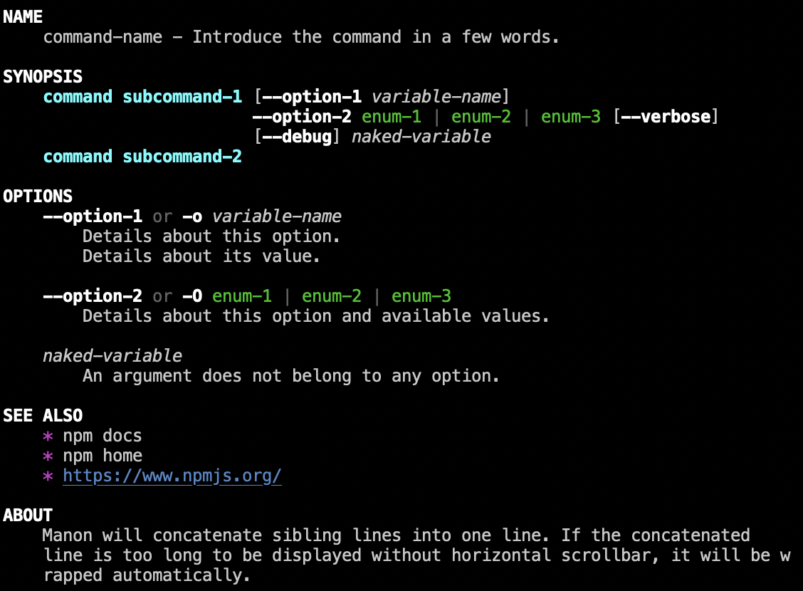
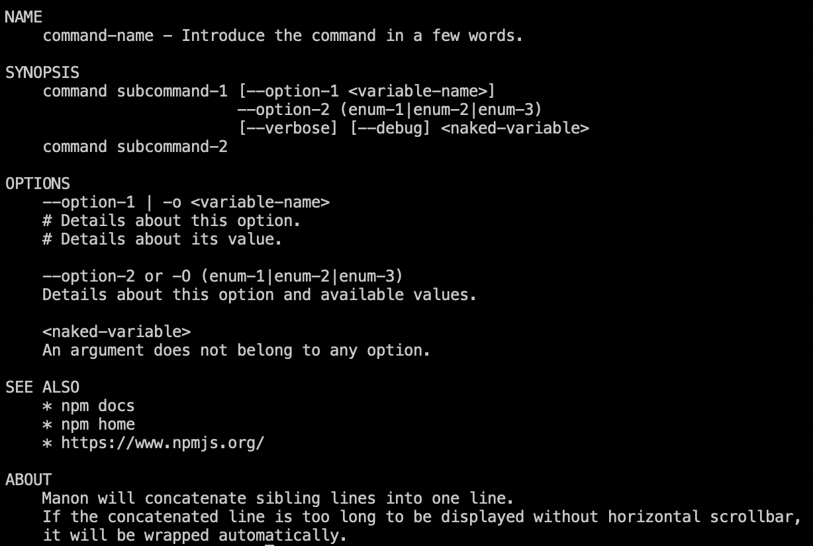

#	manon
__Manual page render__

Parse manual page text and render in more friendly style.

##	Table of contents

*	[Get Started](#get-started)
*	[API](#api)
* 	[Examples](#examples)

##	Links

*	[CHANGE LOG](./CHANGELOG.md)
*	[Homepage](https://github.com/YounGoat/nodejs.manon)

##	Get Started

```javascript
const manon = require('manon');

// Return formatted text.
let richText = manon.format(manualText, 'console');

// Send to standard output.
process.stdout.write(richText);
```

Manual text rendered by *manon* may look like:

 
While the original text looks like:


##  Examples

Here is an [example of *manualText*](./example/help.txt).